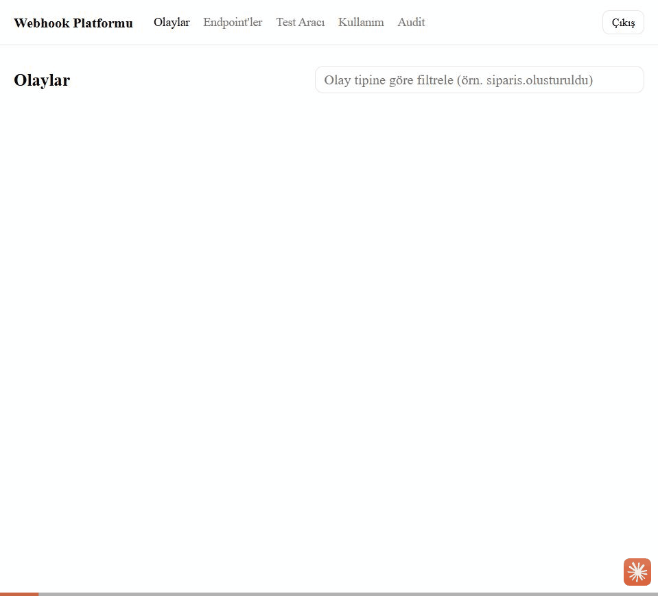

# 3 dakikalık demo

Bu senaryo ürünün asıl iddiasını gösterir: **teslimat başarısız olduğunda ne oluyor.**
Baştan sona yalnızca dashboard kullanılır — terminale tek bir komut için bile dönülmez.



*(Yukarıdaki kayıt `docker-compose.prod.yml` ile ayağa kaldırılmış gerçek bir kurulumda
alındı: giriş → mutlu yol → alıcı bozulur → retry merdiveni → endpoint sağlığı → audit.)*

**Ön koşul:** README'deki "5 dakikada ayağa kaldır" adımları tamamlanmış, `/giris`'ten API
anahtarıyla giriş yapılmış olmalı.

**Demo için devre kesici eşiğini düşür.** Varsayılan eşik 20 ardışık başarısızlık — canlı
demoda oraya ulaşmak için 20 event göndermek gerekir. `worker`'ı şu şekilde başlat:

```bash
mvn spring-boot:run -Dspring-boot.run.profiles=worker \
  -Dspring-boot.run.arguments=--webhook.devre-esigi=3
```

Senaryoda `test-alici`'nin davranışını değiştirmek gerekiyor. Bu tek bir HTTP çağrısı ve
demo boyunca iki kez kullanılıyor — istersen bunları önceden hazırlanmış iki tarayıcı sekmesi
olarak açık tut:

```bash
# alıcıyı bozar (her isteğe 500 döner)
curl -X POST localhost:4000/varsayilan-mod -H 'Content-Type: application/json' -d '{"mod":"hata"}'

# alıcıyı düzeltir
curl -X POST localhost:4000/varsayilan-mod -H 'Content-Type: application/json' -d '{"mod":"ok"}'
```

---

## 0:00 — Mutlu yol (20 sn)

**`/test` sayfası** → hazır senaryolardan `siparis.olusturuldu` seç → **Gönder**.

Teslimat timeline'ına yönlendirilirsin. Bir denemede `200`, durum **BAŞARILI**.

> **Söylenecek:** "Normal akış bu. Event geldi, HMAC ile imzalandı, abonenin endpoint'ine
> POST edildi, tek denemede başarılı. İlginç kısım burası değil."

## 0:20 — Alıcı bozulur, retry merdiveni devreye girer (50 sn)

Alıcıyı boz (`mod: hata`) → **`/test`** → aynı event'i tekrar gönder.

Timeline'da denemeler **canlı olarak** birikir: 1. deneme `500`, ~2 sn sonra 2. deneme `500`,
~4 sn sonra 3. deneme `500`. Her satırda HTTP kodu, süre ve bir sonraki denemeye kalan backoff
görünür.

> **Söylenecek:** "Retry'ı biz yazmadık — `gorev-motoru` yapıyor: üstel backoff + jitter.
> Endpoint'in retry profili `HIZLI` (3 deneme); `STANDART` 8, `UZUN` 15 denemeye kadar gider."

## 1:10 — Retry bütçesi tükenir, DLQ (20 sn)

3. deneme de başarısız olunca durum **DLQ** olur (ölü mektup kutusu).

> **Söylenecek:** "Event kaybolmadı. Payload, tüm denemeler, hata gövdeleri duruyor — teslimat
> yeniden gönderilmeye hazır bekliyor."

## 1:30 — Devre kesici (30 sn)

**`/test`** → aynı event'i iki kez daha gönder (alıcı hâlâ bozuk). Her biri retry'larını
tüketip DLQ'ya düşecek.

**`/endpointler` sayfası** → endpoint'in **Sağlık Skoru**nun düştüğünü (kırmızı ⚠) ve
eşik (yukarıda `3`'e çekildi) aşılınca **Devre** sütununun **AÇIK** olduğunu göster.

Devre açıkken gönderilen event'ler için teslimat **BEKLEMEDE** durumunda birikir — ölü bir
endpoint'e boşuna istek yağdırılmaz. `/test`'ten bir event daha gönderip bunu göster.

**`/audit` sayfası** → `DEVRE_ACILDI` ve `SAGLIK_SKORU_DUSTU` kayıtlarını göster.

> **Söylenecek:** "Sağlık skoru son 24 saatin başarı oranı + gecikmesinden hesaplanıyor.
> Eşiğin altına düştüğü anda bir kez uyarı bırakılıyor — her kontrolde tekrar tekrar değil."

## 2:00 — Düzelt ve tek tıkla yeniden gönder (40 sn)

Alıcıyı düzelt (`mod: ok`).

Devre açıldıysa **`/endpointler`** → **Devre Sıfırla**. Devre kapanınca **BEKLEMEDE**'de
biriken teslimatlar da kuyruğa alınır — birazdan `/olaylar` sayfasında onların da başarılı
olduğunu göster. (Elle sıfırlamasan da sağlık sondası 5 dakikada bir kendisi deneyip devreyi
kapatır; demoda beklememek için elle sıfırlıyoruz.)

**`/teslimatlar`** → DLQ'daki teslimatı aç → **Yeniden Gönder**.

Yeni bir teslimat satırı oluşur (eskisine "orijinal teslimat" linkiyle bağlı), bu kez
**BAŞARILI**.

> **Söylenecek:** "Yeniden gönderim eski kaydın üstüne yazmıyor — yeni bir teslimat üretiyor,
> böylece timeline dürüst kalıyor: ne zaman patladığı da, ne zaman düzeldiği de duruyor.
> Motor tarafında da yeni bir idempotency anahtarı üretiliyor; anahtar olay id'sine değil
> **teslimat** id'sine bağlı olduğu için yeniden gönderim gerçekten tekrar çalışıyor."

## 2:40 — Kapanış (20 sn)

**`/kullanim`** → kota çubuğu ve günlük başarılı/başarısız dökümü.

İstersen `http://localhost:8080/actuator/prometheus` → `webhook_teslimat_sonuc_total`,
`webhook_devre_acik` metrikleri; hazır Grafana panosu
[`gozlemlenebilirlik/grafana-dashboard.json`](gozlemlenebilirlik/grafana-dashboard.json).

> **Kapanış cümlesi:** "Bir webhook göndermek kolay. Bu ürün, gönderim başarısız olduğunda ne
> olduğunu — retry, DLQ, devre kesici, yeniden gönderim, denetlenebilir timeline — hazır
> veriyor."

---

## Demoyu sıfırlama

```bash
curl -X POST localhost:4000/sifirla                                   # alıcının kayıtları
curl -X POST localhost:4000/varsayilan-mod -H 'Content-Type: application/json' -d '{"mod":"ok"}'
```

Endpoint'in devresi açık kaldıysa `/endpointler` → **Devre Sıfırla**. Sağlık skoru son 24
saate baktığı için önceki demonun başarısızlıkları skoru bir süre düşük tutar; tamamen temiz
bir başlangıç için `docker compose down -v && docker compose up -d` ile veritabanını
sıfırlayıp `seed` profilini tekrar çalıştır.
