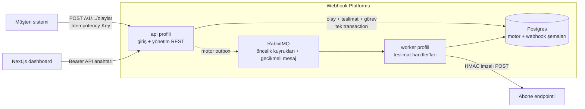

# Webhook Platformu

Müşteri sistemlerinin gönderdiği event'leri, abonelerin endpoint'lerine güvenilir şekilde
teslim eden bir webhook teslimat platformu (Svix/Hookdeck/Convoy tarzı).

Ürünün değeri teslimatın kendisi değil, **teslimatın başarısız olduğu anda ne olduğudur**:
imzalama (HMAC), yapılandırılabilir retry merdiveni, ölü mektup kutusu, devre kesici, tek
tıkla yeniden gönderim ve her denemenin görülebildiği bir timeline.

Yürütme motoru olarak [`gorev-motoru`](https://github.com/gitahmetcelik/gorev-motoru)
(`motor-spring-starter`) kullanılır — retry+backoff, DLQ, idempotency, öncelik kuyrukları
buradan gelir; bu repo motoru bir Maven bağımlılığı olarak tüketir, motor koduna dokunmaz.

## Mimari



Giriş isteği tek transaction'da olayı, filtreye uyan her endpoint için bir teslimatı ve
motora bir görevi yazar; motorun outbox'ı sayesinde transaction commit olmadan hiçbir şey
kuyruğa girmez. Worker teslimatı imzalayıp gerçekten POST eder; başarısızlıkta motorun retry
merdiveni, tükenince DLQ, ardışık kalıcı hatalarda devre kesici devreye girer.

**Neden iki ayrı profil (`api` / `worker`):** giriş trafiği ile teslimat yükü birbirini
etkilemesin diye — `api` motor tüketicisini çalıştırmaz (`motor.worker.tuketici-aktif: false`),
`worker` ise HTTP giriş almaz.

## Repo düzeni

```
/backend                 Maven, Spring Boot (Java 21) — teslimat API'si + worker
/frontend                Next.js — dashboard
/test-alici              Kontrol edilebilir webhook alıcısı (kapı testleri için)
/gozlemlenebilirlik      Grafana panosu
/docs                    İmza doğrulama (müşteri tarafı) dokümanı
docker-compose.yml
```

## 5 dakikada ayağa kaldır

**Gereksinimler:** Docker, JDK 21, Node 20+, bir GitHub hesabı.

**1. GitHub Packages kimlik doğrulaması (bir kereye mahsus).** `motor-spring-starter`
[`gorev-motoru`](https://github.com/gitahmetcelik/gorev-motoru) reposunun GitHub Packages
registry'sinden çekilir — local `.m2`'ye elle kurmaya gerek yok:

- https://github.com/settings/tokens/new → **Classic token**, scope `read:packages`
  (+ `repo`, `gorev-motoru` private olduğu için gerekebilir).
  *(Fine-grained token çalışmaz — GitHub Packages Maven registry'si onları desteklemiyor.)*
- `~/.m2/settings.xml` (yoksa oluştur):
  ```xml
  <settings>
    <servers>
      <server>
        <id>github-gorev-motoru</id>
        <username>KENDI_GITHUB_KULLANICI_ADIN</username>
        <password>ghp_...</password>
      </server>
    </servers>
  </settings>
  ```

**2. Altyapıyı başlat:**
```bash
cp .env.example .env
docker compose up -d postgres rabbitmq test-alici
# postgres: localhost:5433, rabbitmq: localhost:5673 (15673 yönetim arayüzü) —
# gorev-motoru'nun kendi geliştirme container'larıyla (5432/5672) çakışmasın diye farklı port.
```

**3. Backend'i başlat** (iki ayrı terminal):
```bash
cd backend
mvn spring-boot:run -Dspring-boot.run.profiles=api      # 8080
mvn spring-boot:run -Dspring-boot.run.profiles=worker   # 8081
```

**4. Demo verisi üret** (bir kere — iki organizasyon, her birine uygulama + endpoint +
API anahtarı). `seed` profili log'a `TOHUM [...] API anahtari (Authorization: Bearer ...)=...`
satırlarını basar, o anahtarı kopyalayın:
```bash
mvn spring-boot:run -Dspring-boot.run.profiles=api,seed
```

**5. Dashboard'u başlat:**
```bash
cd frontend
cp .env.local.example .env.local
npm install && npm run dev      # http://localhost:3000
```

`http://localhost:3000/giris` → 4. adımdaki API anahtarını yapıştırın. Uçtan uca akışı
terminale hiç dokunmadan denemek için `/test` sayfasını kullanın.

> **Bu makineye özgü bir tuzak:** ortamda proje dışı bir `SERVER_PORT` değişkeni varsa
> Spring Boot'un relaxed binding'i yüzünden `server.port` ezilir ve uygulama beklenmedik bir
> portta açılır.

## API referansı

Tüm `/v1/**` uç noktaları `Authorization: Bearer <api-anahtarı>` ister. Organizasyon sınırını
aşan her okuma/yazma **404** döner (403 değil — varlık sızdırmamak için).

### Giriş (müşteri sistemlerinin kullandığı)

| Uç nokta | Açıklama |
|---|---|
| `POST /v1/uygulamalar/{uygulamaId}/olaylar` | Event gönderir. **`Idempotency-Key` başlığı zorunlu.** Gövde: `{"tip": "...", "payload": {...}}`. Yeni event `201`, aynı anahtarla tekrar `200` (aynı olay/teslimatlar döner). Kota aşımında `429`. |

### Olaylar ve teslimatlar

| Uç nokta | Açıklama |
|---|---|
| `GET /v1/uygulamalar/{uygulamaId}/olaylar` | Sayfalı olay listesi. Filtre: `tip`, `baslangic`, `bitis`. |
| `GET /v1/teslimatlar` | Sayfalı teslimat listesi. Filtre: `durum`, `endpointId`, `baslangic`, `bitis`. |
| `GET /v1/teslimatlar/{id}` | Teslimat detayı: deneme timeline'ı, payload, motordaki görev özeti, trace id. |
| `POST /v1/teslimatlar/{id}/yeniden-gonder` | Yalnızca `DLQ` / `KALICI_HATA` durumundan. **Yeni** bir teslimat satırı üretir (`anaTeslimatId` eskiye bağlar), `201`. |

### Endpoint yönetimi

| Uç nokta | Açıklama |
|---|---|
| `GET /v1/uygulamalar` | Organizasyonun uygulamaları. |
| `GET`/`POST /v1/uygulamalar/{uygulamaId}/endpointler` | Listele / oluştur. Secret **yalnızca oluşturma yanıtında bir kez** döner. |
| `GET`/`PATCH /v1/endpointler/{id}` | Detay (sağlık skoru dahil) / güncelle (URL, olay filtresi, retry profili, hız sınırı). |
| `POST /v1/endpointler/{id}/devre-sifirla` | Devre kesiciyi elle kapatır. |
| `POST /v1/endpointler/{id}/secret-rotasyon` | Yeni secret üretir, eskisi 24 saat doğrulamada geçerli kalır. |
| `POST /v1/endpointler/{id}/imza-dogrula` | Bir imzayı aktif ve (grace içindeyse) eski secret'a karşı doğrular — rotasyonu test etmek için. |

### Organizasyon

| Uç nokta | Açıklama |
|---|---|
| `GET /v1/organizasyon/ben` | Organizasyon bilgisi, aylık kota ve bu ayki kullanım. |
| `GET /v1/kullanim` | Bu ayın günlük başarılı/başarısız dökümü. |
| `GET /v1/audit` | Sayfalı denetim kayıtları (devre, secret rotasyonu, API anahtarı, sağlık uyarıları). |
| `GET`/`POST /v1/organizasyon/api-anahtarlari` | Listele / üret (anahtar bir kez gösterilir). |
| `POST /v1/organizasyon/api-anahtarlari/{id}/iptal` | Anahtarı iptal eder. |

Müşteri tarafında imza doğrulamanın nasıl yapılacağı (örnek kodlarla):
[`docs/imza-dogrulama.md`](docs/imza-dogrulama.md).

## Testler

```bash
cd backend
mvn test        # Docker gerekir - Testcontainers Postgres + RabbitMQ + test-alici ayağa kaldırır
```

Uçtan uca suite (`backend/src/test/java/com/webhookplatformu/e2e/`) gerçek bir Postgres,
gerçek bir RabbitMQ (delayed-message plugin'li, geliştirmedeki aynı imaj) ve `test-alici`'nin
kendi Dockerfile'ından build edilmiş bir container'ına karşı, gerçek HTTP çağrılarıyla 17
senaryoyu doğrular: başarılı teslimat, imza doğrulama, giriş idempotency'si, retry merdiveni,
DLQ'ya düşüş, DLQ'dan yeniden gönderim, kalıcı hata (retry yok), devre kesici aç/kapa, kiracı
izolasyonu, kota aşımı, trace zinciri, Prometheus metrik isimleri, sağlık skoru ve eşik
uyarısı. Her test kendi izole organizasyonunu oluşturur.

> Container'lar test sınıfları arasında **singleton** olarak paylaşılır (`@Testcontainers`/
> `@Container` bilinçli olarak kullanılmaz). O anotasyonlar container'ı her sınıf sonunda
> durdururken Spring context'i cache'lendiği için, sonraki sınıf ölmüş container'ın JDBC
> URL'ini yeniden kullanıp tüm testleri patlatıyordu.

CI (`.github/workflows/ci.yml`) bu suite'i her PR'da koşar. `motor-spring-starter` GitHub
Packages'tan çekildiği için CI'ın `GH_PACKAGES_TOKEN` repo secret'ına ihtiyacı var
(`read:packages` yetkili classic PAT).

## Endpoint sağlık skoru

Her endpoint için son 24 saatten canlı hesaplanan **0-100** skor: başarı oranının %70'i +
ortalama gecikmenin %30'u (≤200ms tam puan, ≥5sn sıfır puan). Son 24 saatte hiç trafik yoksa
skor `null` — bu "kötü" değil "bilinmiyor" demektir, uyarı da üretmez.

Skor **70'in altına düştüğü an** organizasyona bir audit kaydı bırakılır
(`SAGLIK_SKORU_DUSTU`), tekrar üstüne çıkınca `SAGLIK_SKORU_DUZELDI`. Uyarı yalnızca **geçiş
anlarında** üretilir — endpoint üzerindeki bayrak sayesinde periyodik kontrol aynı uyarıyı
tekrar tekrar yazmaz. Skor `/endpointler` sayfasında renkli olarak görünür.

> Bildirim kanalı olarak e-posta değil audit/dashboard seçildi: bu üründe henüz kullanıcı/
> e-posta modeli yok (dashboard oturumu bile API anahtarı yapıştırmayla çalışıyor), yani
> gönderilecek bir adres yok. E-posta eklendiğinde aynı geçiş noktasına bağlanabilir.

## Gözlemlenebilirlik

**Trace id.** Bir giriş isteği (`POST .../olaylar`) tek bir trace id üretir; bu id hem olaya
hem ondan doğan **tüm** teslimatlara yazılır, teslimat detay sayfasında görünür ve tek tıkla
kopyalanabilir. Böylece "bu event'e ne oldu" sorusu, olayın kaç endpoint'e dağıldığından
bağımsız olarak tek bir id ile hem UI'da hem loglarda cevaplanabilir.

> Bu, `micrometer-tracing-bridge-brave` bağımlılığını gerektiriyor. Bridge olmadan `Tracer`
> bean'i hiç oluşmuyor ve motorun `TraceBaglamServisi`'si her görev için rastgele bir UUID'ye
> düşüyor — yani aynı olaydan doğan iki teslimat **farklı** trace id alıyordu (Faz 5.2'de
> bulundu).

**Metrikler** — `/actuator/prometheus`:

| Metrik | Ne ölçer |
|---|---|
| `webhook_teslimat_sonuc_total{sonuc}` | Ürün seviyesinde teslimat sonucu (`basarili`/`kalici_hata`/`dlq`) — başarı oranı buradan türetilir |
| `webhook_teslimat_suresi_seconds_bucket` | Tek bir HTTP teslimat denemesinin süresi (histogram → p50/p95) |
| `webhook_devre_acik` | Devresi açık endpoint sayısı |
| `gorev_kuyruk_derinlik{kuyruk}` | Motorun öncelik kuyrukları + DLQ derinliği |
| `gorev_yeniden_deneme_total{tip}` | Motorun retry merdivenine düşen görevler |

İlk üçü ürün seviyesinde, son ikisi motordan gelir — ayrım önemli: kalıcı hata motor için
*başarıyla tamamlanmış* bir görev, ürün için *başarısız* bir teslimattır.

Hazır Grafana panosu: `gozlemlenebilirlik/grafana-dashboard.json` (Grafana → Dashboards →
Import). Pano bu metrik isimlerine göre yazıldığı için, isimlerin Prometheus çıktısında
gerçekten böyle göründüğü `GozlemlenebilirlikTestleri` ile doğrulanıyor.

## Arayüz (dashboard) ne işe yarar, ne test eder

Dashboard bu üründe bir demo aracı değil, ürünün kendisidir — Faz 2'de curl ile yapılan her
şeyin arayüzden yapılabilmesi hedeflendi (bkz Faz 3 planı). Her sayfa, motorun/backend'in
belirli bir dayanıklılık davranışını gerçekten tetikleyip gözlemlemek için var:

- **`/giris`** — API anahtarını yapıştırıp organizasyon kimliğini doğrular
  (`GET /v1/organizasyon/ben`), `localStorage`'a kaydeder. Bundan sonraki her istek bu
  anahtarla imzalanır; anahtar yoksa veya geçersizse otomatik buraya yönlendirilir. **Test
  ettiği şey:** API-anahtarlı kimlik doğrulama + kiracı (organizasyon) izolasyonunun
  çalıştığı — başka bir organizasyonun anahtarıyla giriş yapılınca sadece o organizasyonun
  verisi görünür.

- **`/olaylar`** — Bir uygulamaya ait tüm gelen event'lerin (webhook girişlerinin) 5
  saniyede bir kendini yenileyen listesi, her satırda o event'in tetiklediği teslimatların
  özeti (`n/m başarılı`). **Test ettiği şey:** giriş API'sinin (`POST .../olaylar`) event'i
  doğru kaydettiği, filtreye uyan endpoint'ler için doğru sayıda teslimat ürettiği.

- **`/teslimatlar/{id}`** — Ürünün vitrini: tek bir teslimatın durum rozetini, motor
  tarafındaki gerçek durumunu (`GorevYonetimServisi.ozet()` ile), ve **deneme timeline'ını**
  gösterir — her deneme için zaman, HTTP durum kodu, süre, bir sonraki denemeye kalan
  backoff. Payload/başlık/yanıt gövdesi incelenebilir, "curl olarak kopyala" ile tekrar
  denenebilir. **Devre açıksa** veya **DLQ'ya düştüyse** buradan tek tıkla **Yeniden Gönder**
  edilebilir. **Test ettiği şey:** motorun retry+backoff'unun, DLQ'ya düşüşün ve manuel
  yeniden-gönderim akışının (yeni teslimat satırı üretip eski teslimata bağlaması dahil)
  gerçekten çalıştığı.

- **`/endpointler`** — Bir uygulamaya bağlı tüm endpoint'lerin listesi: URL, event filtresi,
  retry profili, son 24 saatlik başarı oranı, devre kesici durumu (Sağlıklı/Yarı Açık/Açık).
  Buradan endpoint oluşturulur (secret bir kez gösterilir), düzenlenir, hız sınırı
  ayarlanır, secret rotasyonu yapılır, devre elle sıfırlanır. **Test ettiği şey:** devre
  kesicinin (ardışık kalıcı hatadan sonra devrenin açılması, sağlık sondasının kapatması),
  endpoint bazlı rate limiting'in (motorun `planlananZaman` zamanlamasıyla teslimatları
  yaymasının) ve secret rotasyonunun (eski secret'ın grace penceresinde hâlâ geçerli
  kalmasının) gerçekten işlediği.

- **`/test`** — Hazır senaryolardan (`siparis.olusturuldu`, `odeme.basarili`,
  `iade.talep-edildi`) bir event tipi seçip payload'ı düzenleyerek gerçek bir webhook
  girişini tetikler, oluşan teslimatın timeline'ına yönlendirir. **Test ettiği şey:** uçtan
  uca akışın (giriş → endpoint eşleştirme → motora gönderim → gerçek HTTP POST →
  `test-alici`'ye ulaşma) tamamının, terminale hiç dokunmadan arayüzden tetiklenebildiği.

- **`/kullanim`** — Bu ayki teslimat kullanımını aylık kotaya karşı bir çubukla gösterir,
  günlük başarılı/başarısız dökümü listeler, API anahtarı üretir/iptal eder (üretilen
  anahtar bir kez gösterilir). **Test ettiği şey:** kullanım sayacının doğru arttığı, kota
  aşımının event kabulünü gerçekten `429` ile reddettiği, API anahtarı yaşam döngüsünün
  (üret/iptal) çalıştığı.

- **`/audit`** — Organizasyona ait tüm denetim kayıtlarının (devre sıfırlama, secret
  rotasyonu, API anahtarı üretme/iptal) sayfalı listesi. **Test ettiği şey:** hassas/
  operasyonel her aksiyonun gerçekten iz bıraktığı — kimin ne zaman ne yaptığının sonradan
  denetlenebildiği.

Ortak payda: her sayfa arkasındaki API çağrısı `Authorization: Bearer <api-anahtarı>` ile
gider ve backend'de organizasyon sınırını aşan hiçbir okuma/yazma **404** (varlık
sızdırmadan) döner — bu, dashboard'un kendisinin de kiracı izolasyonunu ihlal edemeyeceği
anlamına gelir.

## Dağıtım

Tam yığın (Postgres, RabbitMQ, `backend-api`, `backend-worker`, dashboard, `test-alici`) tek
komutla ayağa kalkar:

```bash
cp .env.prod.example .env.prod
# .env.prod içindeki şifreleri ve WEBHOOK_SIFRELEME_ANAHTARI'nı doldur (openssl rand -base64 32)
docker compose -f docker-compose.prod.yml --env-file .env.prod up -d --build
```

Geliştirme `docker-compose.yml`'inden farkları:

- **Backend ve dashboard da konteynerde.** Bu artık mümkün çünkü `motor-spring-starter` GitHub
  Packages'ta (Faz 5.0). Maven kimlik bilgisi imaja gömülmez — build sırasında
  `~/.m2/settings.xml` bir **BuildKit secret'ı** olarak bağlanır (`build-arg` kullanılsaydı
  token `docker history` çıktısında kalırdı).
- **Postgres ve RabbitMQ dışarıya port açmaz** — yalnızca compose ağından erişilir.
- **Ayrı compose proje adı** (`webhook-platformu-prod`). Compose proje adını dizin adından
  türetir; bu ayrım olmasaydı prod yığını geliştirme ile aynı `postgres-data` volume'ünü
  paylaşırdı. Postgres şifreyi yalnızca boş bir veri dizinini ilk kez başlatırken uygular,
  dolayısıyla prod şifresi hiç geçerli olmaz ve backend `password authentication failed` ile
  açılmazdı — üstelik prod, geliştirme verisinin üstüne otururdu.
- Worker'ın `stop_grace_period`'ı 70 sn: devam eden teslimatlar kapanışta tamamlanabilsin diye.

Demo verisi üretmek için (tek seferlik):
```bash
docker compose -f docker-compose.prod.yml --env-file .env.prod \
  run --rm -e SPRING_PROFILES_ACTIVE=api,seed --no-deps backend-api
```
Log'daki `TOHUM ... API anahtari` satırındaki anahtarla dashboard'a girilir. (Konteynerde
seed'in ürettiği endpoint `http://test-alici:4000/webhook` adresini gösterir — container
ağında `localhost` backend'in kendisi olurdu.)

**Fly.io'ya dağıtım:** [`dagitim/fly/`](dagitim/fly/README.md) — backend'i tek imajda iki
process grubu (`api` + `worker`), RabbitMQ ve dashboard'u ayrı app olarak kuran
yapılandırma ve adım adım rehber. *(Yazıldı, canlıda henüz doğrulanmadı.)*

## Demo

Ürünün asıl iddiasını (teslimat başarısız olduğunda ne olduğu) baştan sona yalnızca
dashboard kullanarak gösteren 3 dakikalık senaryo: [`DEMO.md`](DEMO.md).

## Durum

Faz 5 (v1.0) sürüyor. Tamamlanan: motor GitHub Packages'ta (5.0), Testcontainers uçtan uca
suite + CI (5.1), gözlemlenebilirlik (5.2), endpoint sağlık skoru (5.3), demo ve
dokümantasyon (5.4). Detaylı plan ve faz kapı testleri için proje sahibinin kendi planlama
notlarına bakınız.
